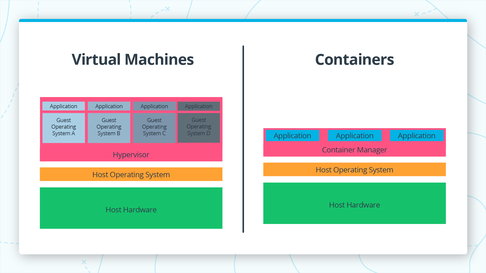

# Continuous Integration and Continuous Deployment

Container tools, including Docker, provide an image-based deployment model.
This makes it easy to share an application, or set of services, with all of
their dependencies across multiple environments.

Docker, by itself, can manage single containers. When you start using more
and more containers and containerized apps, broken down into hundreds of
pieces, management and orchestration can get difficult. Eventually, you need
to take a step back and group containers to deliver services—networking,
security, telemetry, and more—across all of your containers. That's where
Kubernetes comes in.

## Tech. Stack Highlights
- Docker
- Kubernetes
- Python
- Flask

## Docker
A Docker container image is a lightweight, standalone, executable package of
software that includes everything needed to run an application: code, runtime,
system tools, system libraries and settings.

Containers are an abstraction at the app layer that packages code and
dependencies together. Multiple containers can run on the same machine and
share the OS kernel with other containers, each running as isolated processes
in user space. Containers take up less space than VMs (container images are
typically tens of MBs in size), can handle more applications and require
fewer VMs and Operating systems.

Virtual Machine vs Docker Container (Ref: Udacity) :


Building a Docker Container from an Image, Example:

The following example demonstrate pull a postgres image from docker hub and
run to interact from a local port.

```shell script
docker pull postgres:latest
docker run --name psql -e POSTGRES_PASSWORD=password! -p 5433:5432 -d postgres:latest
psql -h 0.0.0.0 -p 5433 -U postgres
```

The command Explanation:

- The `--name` flag allows you to specify a name for the container that can be
    used later to reference the container. If you don’t specify a name,
    Docker will assign a random string name to the container.
- The `-e` flag stands for “environment”. This sets the environment variable
    POSTGRES_PASSWORD to the value password!.
- The `-p` flag stands for “publish”. This allows you to bind your local
    machine’s port 5432 to the container port 5432.
- The `-d` stands for “detach”. This tells Docker run the indicated
    image in the background and print the container ID. When you use
    this command, you will still be able to use the terminal to run
    other commands, otherwise you would need to open a new terminal.

Useful docker commands"
- `docker ps` to see currently active containers
- `docker run` with `-e` and other config to run a container
- `docker stop <image_id>` to stop a command
- `docker build --tag test .` to build an image from a `Dockerfile`  
    the full stop . tells the docker build command using the Dockerfile
    found in the current directory.
- `docker run test -rm` to remove the container after build

### Docker File:
Docker file is an easier way to build, config. and maintain docker containers.

Docker File Example:
```dockerfile
FROM python:3.7.2-slim

COPY . /app
WORKDIR /app

RUN pip install --upgrade pip
RUN pip install flask

ENTRYPOINT ["python", "app.py"]
```

Keyword explanation:
- Dockerfile comments start with #.
- FROM defines source image upon which the image will be based.
- COPY copies files to the image.
- WORKDIR defines the working directory for other commands.
- RUN is used to run commands other than the main executable.
- ENTRYPOINT is used to define the main executable.

## Continuous Delivery Pipeline(Kubernetes, AWS Services)

### Kubernetes (KBS)

Kbs is used to create a cluster of smaller units called machines. Containers
can be controlled using a Master System (MS) interface. Master System has an
API, Scheduler and Management Daemon. Machines under MS are called nodes. Each
unit a Node is called pod. App service layer API is a way to interconnects the
pods as they are not persistent

### Configuring KubCTL and AWS CLI

The following command can be use to interact with AWS:

- `aws config list` to list the current configuration
- `aws configure --profile default` to set up a default profile

Up and Running a Kubernetes Cluster

- Create the cluster: `eksctl create cluster --name eksctl-demo`
- Go to the CloudFormation console to view progress. If you don’t see any
    progress, be sure that you are viewing clusters is the same region that
    they are being created. For example, if `eksctl` is using
    `region us-west-2`, you’ll need to set the region to
    “US West (Oregon)” in the dropdown menu  in the upper
    right of the console.
- Once the status is ‘CREATE_COMPLETE’, check the health of your clusters
    nodes: `kubectl get nodes`
- From the CloudFormation console, select your stack and choose delete
    from the actions menu, or delete using eksctl:
    `eksctl delete cluster eksctl-demo`

## Code Pipeline
- Controls the release process through user defined pipelines
- Pipelines are created either through the CodePipeline console or using awscli
- Pipelines watch a source code repository, changes to this repository
    trigger pipeline action
- Pipelines are made up of stages
- Each stage consists of one or more actions
- There are actions to define the source repository, as well as instructions
    for testing, building, deploying and options for approval
- Pipelines can be managed and viewed in the CodePipeline console

## CodeBuild Recap
- Continuous Integration: frequent check-ins to a central repository which
    trigger automated builds and tests
- CodeBuild: A fully managed continuous integration system offered by AWS
- Codebuild can be added as an action to a CodePipeline stage

```yaml
# Code build sample
version: 0.2

phases:
  install:
    commands:
      - nohup /usr/local/bin/dockerd --host=unix:///var/run/docker.sock --host=tcp://127.0.0.1:2375 --storage-driver=overlay2&
      - timeout 15 sh -c "until docker info; do echo .; sleep 1; done"
  pre_build:
    commands:
      - docker build -t helloworld .
  build:
    commands:
      - docker images
      - docker run helloworld echo "Hello, World!"
```

The study is a part of Udacity Nanodegree course.

## References
1. [Red Hat Docker Overview
](https://www.redhat.com/en/topics/containers/what-is-docker)
2. [Docker Overview by Docker
](https://www.docker.com/resources/what-container)
3. [Docker Images](https://hub.docker.com/)
4. [AWS Code Pipeline
](https://docs.aws.amazon.com/codepipeline/latest/userguide/concepts.html)
5. [Cloud Formation AWS
](https://docs.aws.amazon.com/cloudformation/index.html)
6. [Building Code Pipeline
](https://docs.aws.amazon.com/codebuild/index.html)
